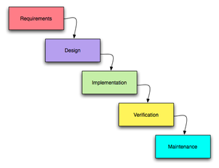
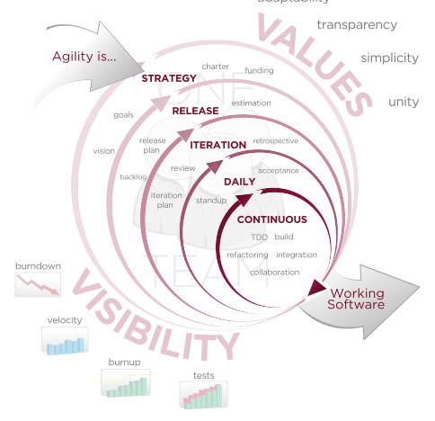

!SLIDE 
## Quality Assurance
## for Drupal Sites
## with Behat and Mink

!SLIDE small bullets
# Melissa Anderson

* [@lz411](http://twitter.com/lz411)
* [eliza411](http://drupal.org/user/33570)

 

!SLIDE small center bullets
# Jonathan Hedstrom

* [@jhedstro](http://twitter.com/jhedstro)
* [jhedstrom](http://drupal.org/user/208732)
* 

!SLIDE
# QA is the voice of the user

!SLIDE small 
# QA touches every part of the development cycle

!SLIDE
# Waterfall

Paul Hoadley / CC-BY-SA-2.5

!SLIDE

Devon Fyson / CC-BY-SA-3.0

!SLIDE

http://www.untoldentertainment.com

!SLIDE
# Behat is a tool for the entire cycle
It's a PHP implementation of Ruby's Cucumber and Python's Lettuce, all of which support Behavior-Driven Development and its three core values ...

!SLIDE
One: Everyone on the team should refer to website features in the same way

!SLIDE
Two: Any feature on the site should have an identified verifiable value to the business or organization <object type="application/x-shockwave-flash" data="http://www.twpics.com/BUTTON5/twitbutton.swf" width="100" height="100"><param name="movie" value="http://www.twpics.com/BUTTON5/twitbutton.swf"></param><param name="allowscriptaccess" value="always"></param><param name="menu" value="false"></param><param name="wmode" value="transparent"></param><param name="flashvars" value="username=bobby_bluesqare"></param><a href="http://www.bluesqaretips.com" title="www.bluesqaretips.com">www.bluesqaretips.com</a><embed src="http://www.twpics.com/BUTTON5/twitbutton.swf" type="application/x-shockwave-flash" allowscriptaccess="always" width="100" height="100" menu="false" wmode="transparent" flashvars="username=bobby_bluesqare"></embed></object>

!SLIDE
Three: Ignorance is the biggest constraint of software development.

Hic sunt dracones

!SLIDE
# Behat provides the common language

  <pre class="sh_java sh_sourceCode">
    <code>
    package org.openqa.selenium.example;

    import org.openqa.selenium.By;
    import org.openqa.selenium.WebDriver;
    import org.openqa.selenium.WebElement;
    import org.openqa.selenium.htmlunit.HtmlUnitDriver;

    public class Example  {
      public static void main(String[] args) {
        // Create a new instance of the html unit driver
        // Notice that the remainder of the code relies on the interface, 
        // not the implementation.
        WebDriver driver = new HtmlUnitDriver();

        // And now use this to visit Google
        driver.get("http://www.google.com");

        // Find the text input element by its name
        WebElement element = driver.findElement(By.name("q"));

        // Enter something to search for
        element.sendKeys("Cheese!");

        // Now submit the form. WebDriver will find the form for us from the element
        element.submit();

        // Check the title of the page
        System.out.println("Page title is: " + driver.getTitle());
      }
    }
    </code>
  </pre>

  Second column

!SLIDE
# Behat incorporates the business value

!SLIDE smaller
# Tell a story

    @@@ gherkin
    Feature: Do not let anonymous people use the PHP filter
      In order to prevent site hacking
      As a site owner
      I need to know that my site is properly configured

!SLIDE smaller
# Elaborate with scenarios

    @@@ gherkin
    Scenario: No php filter for comments
      Given I am on the homepage
       When I follow "Articles"
	    And I follow "Read more"
       Then I should not see "You may post PHP code.
	        You should include <?php ?> tag"

    Given: Put the system in a known state
     When: Act on the system
     Then: Describe the result of the action

!SLIDE smaller
# Save to a file and execute

    @@@ gherkin
    Feature: Do not let anonymous people use the PHP filter
      In order to prevent site hacking
      As a site owner
      I need to know that my site is properly configured

      Scenario: No php filter for comments
        Given I am on the homepage
         When I follow "Articles"
          And I follow "Read more"
         Then I should not see "You may post PHP code.
		      You should include <?php ?> tag"

    1 scenario (1 passed)
    4 steps (4 passed)
    0m0.545s

!SLIDE smaller
# Behat can help us discover what we don't know

    @@@ gherkin
    Feature: Do not let anonymous people use the PHP filter
      In order to prevent site hacking
      As a site owner
      I need to know that my site is properly configured

    Scenario: No php filter for comments
      Given I am on the homepage
       When I follow "Articles"
        And I follow "Read more"
       Then I should not see "You may post PHP code.
	        You should include <?php ?> tag"
        
		    The text "You may post PHP code. You should include <?php ?>
			tag" appears in the text of this page, but it should not.

    1 scenario (1 failed)
    4 steps (3 passed, 1 failed)
    0m0.545s

!SLIDE
# Mink  

## Web acceptance testing
Separates the concept of testing web applications from the actual browser used.

!SLIDE
# Mink Extension

Provides language and corresponding step-definitions for testing web applications.

!SLIDE
# The Drupal Extension

http://drupal.org/project/drupalextension

!SLIDE
# Getting started with the Drupal Extension

Sample `composer.json` file

    @@@ javascript
    {
      "require": {
        "drupal/drupal-extension": "*"
      },
      "minimum-stability": "dev",
      "config": {
        "bin-dir": "bin/"
	  }
	}
	
	@@@ sh
	$ composer install

!SLIDE
# Getting started with the Drupal Extension

Sample `behat.yml` file

!SLIDE
# Roadmap

* Provide reusable language and supporting step definitions common to most Drupal sites.

(Will be ongoing)

!SLIDE small bullets incremental
# Roadmap

Provide multiple ways of manipulating the backend (Drivers).

* Blackbox
  (no direct access to backend)
* Drush
  (uses Drush aliases to access local or remote sites)
* Drupal
  (uses direct Drupal API calls to access local sites)
* Services

!SLIDE
# Roadmap

Support multiple major versions of Drupal

!SLIDE center
# Roadmap

Ability to find and load sub-contexts that can be bundled with contrib modules

Complex features can have common step-definitions (think Media, or Views)

!SLIDE center
# Roadmap

!SLIDE
#Thank you!

Questions?
