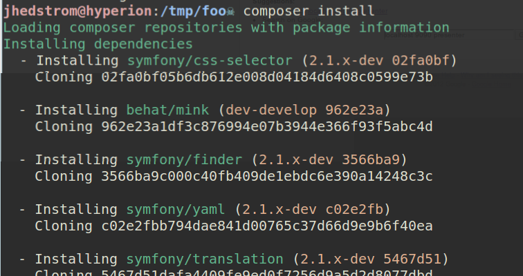
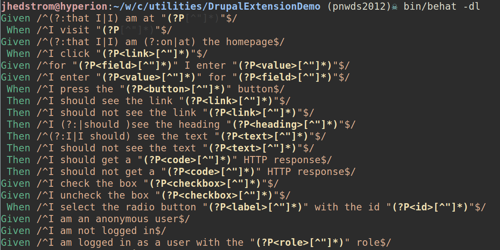

!SLIDE front 
# Quality Assurance for Drupal Sites with Behat and Mink

!SLIDE speaker
# Melissa Anderson

[@lz411](http://twitter.com/lz411)

[eliza411](http://drupal.org/user/33570)

 

!SLIDE speaker
# Jonathan Hedstrom

[@jhedstro](http://twitter.com/jhedstro)

[jhedstrom](http://drupal.org/user/208732)

!SLIDE
# Quality Assurance
## QA is the voice of the user

!SLIDE 
# Quality Assurance
## QA touches every part of the development cycle

* Sales
* Discovery
* Development
* Deployment
* Support

!SLIDE
#Methodology
## Waterfall

Paul Hoadley / CC-BY-SA-2.5

!SLIDE
#Methodology
## Agile

Devon Fyson / CC-BY-SA-3.0

!SLIDE
#Methodology
## On-Demand

http://www.untoldentertainment.com

!SLIDE
# Flavors of BDD tools
* Ruby has Cucumber
* Python has Lettuce
* PHP has Behat

##All of these support three main principals of 
##Behavior Driven Development

!SLIDE 
# BDD Principal 1:
## Everyone on the team should refer to website features in the same way

!SLIDE
# BDD Principal 2:
## Any feature on the site should have an identified verifiable value to the business or organization 

<object type="application/x-shockwave-flash" data="http://www.twpics.com/BUTTON5/twitbutton.swf" width="300" height="300"><param name="movie" value="http://www.twpics.com/BUTTON5/twitbutton.swf"></param><param name="allowscriptaccess" value="always"></param><param name="menu" value="false"></param><param name="wmode" value="transparent"></param><param name="flashvars" value="username=bobby_bluesqare"></param><a href="http://www.bluesqaretips.com" title="www.bluesqaretips.com">www.bluesqaretips.com</a><embed src="http://www.twpics.com/BUTTON5/twitbutton.swf" type="application/x-shockwave-flash" allowscriptaccess="always" width="100" height="100" menu="false" wmode="transparent" flashvars="username=bobby_bluesqare"></embed></object>

!SLIDE bdd-3 bdd
#BDD Principal 3:
##Ignorance is the biggest constraint of software development

Hic sunt dracones

!SLIDE 
# Behat provides a common language

<h3>Selenium test</h3>
  <pre class="sh_java sh_sourceCode">
    <code>
    package org.openqa.selenium.example;

    import org.openqa.selenium.By;
    import org.openqa.selenium.WebDriver;
    import org.openqa.selenium.WebElement;
    import org.openqa.selenium.htmlunit.HtmlUnitDriver;

    public class Example  {
      public static void main(String[] args) {
        // Create a new instance of the html unit driver
        // Notice that the remainder of the code relies on the interface, 
        // not the implementation.
        WebDriver driver = new HtmlUnitDriver();

        // And now use this to visit Google
        driver.get("http://www.google.com");

        // Find the text input element by its name
        WebElement element = driver.findElement(By.name("q"));

        // Enter something to search for
        element.sendKeys("Cheese!");

        // Now submit the form. WebDriver will find the form for us from the element
        element.submit();

        // Check the title of the page
        System.out.println("Page title is: " + driver.getTitle());
      }
    }
    </code>
  </pre>

  <h3> Behat test</h3>
  <pre class="sh_gherkin sh_sourceCode">
    <code>
	Given I am at "http://www.google.com"
	When I enter "Cheese!" for "Search"
	And click "Google Search"
	Then I should see the text "results"
	</code>
  </pre>

!SLIDE
# Behat incorporates the business value

!SLIDE 
# First, tell a story

    @@@ gherkin
    Feature: Do not let anonymous people use the PHP filter
      In order to prevent site hacking
      As a site owner
      I need to know that my site is properly configured

!SLIDE 
# Next, elaborate with scenarios

    @@@ gherkin
    Scenario: No php filter for comments
      Given I am on the homepage
      When I follow "Articles"
      And I follow "Read more"
      Then I should not see "You may post PHP code.
	        You should include <?php ?> tag"

      Given: Put the system in a known state
      When: Act on the system
      Then: Describe the result of the action

!SLIDE 
# Finally, save to a file and execute

    @@@ gherkin
    Feature: Do not let anonymous people use the PHP filter
      In order to prevent site hacking
      As a site owner
      I need to know that my site is properly configured

      Scenario: No php filter for comments
      Given I am on the homepage
      When I follow "Articles"
      And I follow "Read more"
      Then I should not see "You may post PHP code.
		      You should include <?php ?> tag"

    1 scenario (1 passed)
    4 steps (4 passed)
    0m0.545s

!SLIDE 
#  Behat
##  Discover what we don't know

    @@@ gherkin
    Feature: Do not let anonymous people use the PHP filter
      In order to prevent site hacking
      As a site owner
      I need to know that my site is properly configured

    Scenario: No php filter for comments
      Given I am on the homepage
      When I follow "Articles"
      And I follow "Read more"
      Then I should not see "You may post PHP code.
	       You should include <?php ?> tag"
        
		    The text "You may post PHP code. You should include <?php ?>
			tag" appears in the text of this page, but it should not.

    1 scenario (1 failed)
    4 steps (3 passed, 1 failed)
    0m0.545s

!SLIDE
# Mink  

## Web acceptance testing
Separates the concept of testing web applications from the actual browser used.

[http://mink.behat.org](http://mink.behat.org)

!SLIDE small bullets incremental
# Supported browser drivers

* Goutte
* Selenium
* WebDriver (Selenium 2)
* Sahi
* Zombie

!SLIDE
# Mink Extension

Provides language and corresponding step-definitions for testing web applications.

!SLIDE
# Mink Extension

Provides language and corresponding step-definitions for testing web applications.

    @@@ gherkin
    Given I visit "http://google.com"
    When I fill in "Drupal" for "Search"
	And press "Search"
	Then I should see the link "http://drupal.org"

!SLIDE bullets incremental
# The Drupal Extension

* Provides language and step-definitions specific to testing Drupal web applications.
* Builds on top of the Mink Extension
* http://drupal.org/project/drupalextension

!SLIDE 
# The Drupal Extension

    @@@ gherkin
	Given I am logged in as a user with the "administrator" role
	When I am at "node/add"
	Then I should see the link "Article"
	And I should see the link "Basic page"

!SLIDE small
# Getting started with the Drupal Extension

Sample `composer.json` file

    @@@ javascript
    {
      "require": {
        "drupal/drupal-extension": "*"
      },
      "minimum-stability": "dev",
      "config": {
        "bin-dir": "bin/"
	  }
	}

!SLIDE 
# Getting started with the Drupal Extension

You'll need to install *Composer* (http://getcomposer.org). I install
it globally so I can just call `composer`.

    @@@ bash
	$ composer install

!SLIDE 
# Getting started with the Drupal Extension

Sample `behat.yml` file

    @@@ yml
    default:
      paths:
        features: 'features'
      extensions:
        Behat\MinkExtension\Extension:
          goutte: ~
          selenium2: ~
            base_url: http://git6site.devdrupal.org/
        Drupal\DrupalExtension\Extension:
          blackbox: ~

!SLIDE center 
# Getting started with the Drupal Extension

List of available step definitions

    @@@ sh
	bin/behat -dl

.notes Live demo

!SLIDE center

<iframe width="853" height="480" src="http://www.youtube.com/embed/-EmGuuHGUhk?rel=0" frameborder="0" allowfullscreen></iframe>

!SLIDE center
# Roadmap

!SLIDE center
# Roadmap

Provide reusable language and supporting step definitions common to most Drupal sites.

(Will be ongoing)

!SLIDE center bullets incremental
# Roadmap

Provide multiple ways of manipulating the backend (Drivers).

* Blackbox
  (no direct access to backend)
* Drush
  (uses Drush aliases to access local or remote sites)
* Drupal
  (uses direct Drupal API calls to access local sites)
* Services

!SLIDE center
# Roadmap

Support multiple major versions of Drupal

!SLIDE center bullets incremental
# Roadmap

* Ability to find and load sub-contexts that can be bundled with contrib modules
* Complex features can have common step-definitions (think Media, or Views)

!SLIDE 
#Thank you!

##Questions?

Druplicon *beehat* by jessehs

Slides available at http://jhedstrom.github.com
